# lka-carla
 
In this Project have Develop a lane detection pipeline using YOLO and Pure Vision and SCNN within CARLA simulator by Apply controller to keep the vehicle centered in the lane

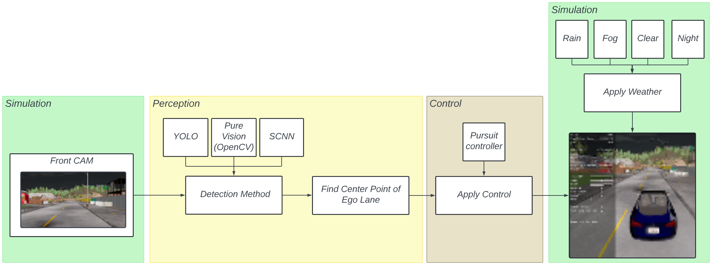

## Table of Contents

- [Install](#install)
- [How to Run](#how-to-run)
- [How to change Weather in CARLA](#how-to-change-weather-in-carla)
- [How to Collect Dataset for Training](#how-to-collect-dataset-for-training)
- [YOLO](#yolo)
  - [How to Train YOLO](#how-to-train-yolo)
  - [How to Process YOLO output](#how-to-process-yolo-output)
- [Pure Vision (OpenCV)](#pure-vision-opencv)
  - [How to Process Pure Vision output](#how-to-process-pure-vision-output)
- [SCNN](#scnn)
  - [How to Train SCNN](#how-to-train-scnn)
  - [How to Process SCNN output](#how-to-process-scnn-output)
  - [How to find Lane center from All Perception Methods](#how-to-find-lane-center-from-all-perception-methods)
- [How to Save Test Experiment 1 and Experiment 2](#how-to-save-test-experiment-1-and-experiment-2)
  - [Experiment 1 — Perception Performance](#experiment-1--perception-performance)
  - [Experiment 2 — Controller Performance](#experiment-2--controller-performance)
- [Results](#results)
  - [Experiment 1 — Perception Performance](#experiment-1--perception-performance-1)
  - [Experiment 2 — Controller Performance](#experiment-2--controller-performance-1)
- [References](#references)

## Install

1. Install CARLA Simulator click here to download [CARLA Simulator v0.9.16](https://github.com/carla-simulator/carla/releases/tag/0.9.16)

2. Git clone this repository

```bash
git clone https://github.com/peeradonmoke2002/lka-carla.git
```
3. Install submodules

```bash
cd lka-carla
git submodule update --init --recursive
```
This will clone repo carla-ros bridge which important for communication between CARLA and ROS2 for more information about carla-ros bridge please visit [carla-ros-bridge](https://github.com/peeradonmoke2002/carla_ros.git) at branch `lka`

4. Build ROS2 workspace

```bash
cd lka-carla/lka_ws
colcon build --symlink-install
```

5. Source ROS2 workspace

>[!NOTE]
> Make sure to source the ROS2 workspace before running any ROS2 commands.

```bash
cd lka-carla/lka_ws
source install/setup.bash
```

## How to Run

1. Start CARLA Simulator
```bash
cd carla
./CarlaUE4.sh -prefernvidia -RenderOffScreen
```
2. Start CARLA ROS bridge
```bash
cd lka-carla-yolo/lka_ws
source install/setup.bash && ros2 launch lka_bringup bring_up_carla.launch.py
```
It shoude pop-up like this images below:
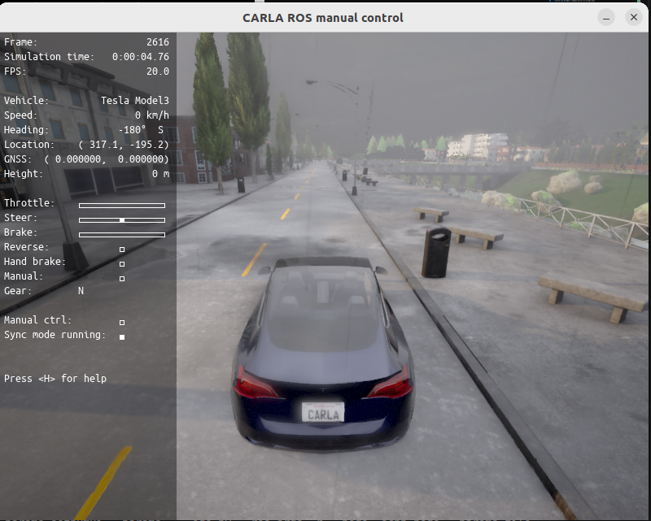

To make sure is work you may check ros2 topics
```bash
ros2 topic list
```
You should see topics like this:

```bash
/carla/actor_list
/carla/control
/carla/debug_marker
/carla/ego_vehicle/CAM_FRONT/camera_info
/carla/ego_vehicle/CAM_FRONT/image
/carla/ego_vehicle/CAM_VIEW/camera_info
/carla/ego_vehicle/CAM_VIEW/control/set_target_velocity
/carla/ego_vehicle/CAM_VIEW/control/set_transform
/carla/ego_vehicle/CAM_VIEW/image
/carla/ego_vehicle/collision
/carla/ego_vehicle/control/set_target_velocity
/carla/ego_vehicle/control/set_transform
/carla/ego_vehicle/enable_autopilot
/carla/ego_vehicle/gnss
/carla/ego_vehicle/lane_invasion
/carla/ego_vehicle/objects
/carla/ego_vehicle/odometry
/carla/ego_vehicle/semantic_segmentation_front/camera_info
/carla/ego_vehicle/semantic_segmentation_front/image
/carla/ego_vehicle/speedometer
/carla/ego_vehicle/vehicle_control_cmd
/carla/ego_vehicle/vehicle_control_cmd_manual
/carla/ego_vehicle/vehicle_control_manual_override
/carla/ego_vehicle/vehicle_info
/carla/ego_vehicle/vehicle_status
/carla/map
/carla/markers
/carla/markers/static
/carla/objects
/carla/status
/carla/traffic_lights/info
/carla/traffic_lights/status
/carla/weather_control
/carla/world_info
/clock
/initialpose
/lka/gt/cross_track_m
/parameter_events
/rosout
/tf
```
3. Start perception nodes

```bash
# Pure Vision node only
source install/setup.bash &&
ros2 launch lka_perception pure_vision.launch.py
# YOLO node only
source install/setup.bash &&
ros2 launch lka_perception yolo.launch.py
# SCNN node only
source install/setup.bash &&  
ros2 launch lka_perception scnn.launch.py
# All perception nodes
source install/setup.bash &&
ros2 launch lka_perception run_all_perception.launch.py
```
Check the topics again you should see like this:
```bash
/lka/enhanced_image # from yolo node image type
/lka/gt/cross_track_m # from gt node cross track error information
/lka/pure_vision/lane_center # from pure vision node lane center infomation
/lka/pure_vision_image # from pure vision node image type
/lka/scnn/lane_center # from scnn node lane center infomation
/lka/scnn_image # from scnn node image type
/lka/yolo/lane_center # from yolo node lane center infomation
```
When run all perception nodes you should see like this use `rqt` to visualize the topics:
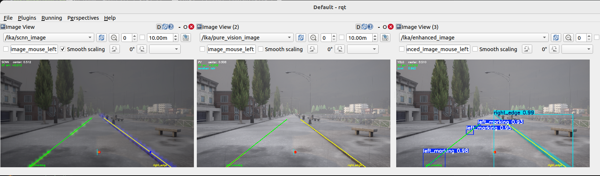


4. Run Controller node

>[!IMPORTANT]
> This node only resive topic `/lka/lane_center` pls make sure that when test you need to remap topic peception to this first before run controller node.

```bash
source install/setup.bash &&
ros2 launch lka_control lka_controller.launch.py
```

How to remap before run controller node

```bash
# Remap pure vision topic
# For Yolo node
source install/setup.bash &&
ros2 launch lka_perception yolo.launch.py \
  --ros-args -r /lka/yolo/lane_center:=/lka/lane_center

# For pure vision node
source install/setup.bash &&
ros2 launch lka_perception pure_vision.launch.py \
  --ros-args -r /lka/pure_vision/lane_center:=/lka/lane_center

# For SCNN node
source install/setup.bash &&
ros2 launch lka_perception scnn.launch.py \
  --ros-args -r /lka/scnn/lane_center:=/lka/lane_center
``` 

## How to change Weather in CARLA

For manually changing weather in CARLA, you can publish to the `/carla/weather_control` topic with `CarlaWeatherParameters` message. Here are some example presets:

```bash
# Clear
ros2 topic pub --once /carla/weather_control carla_msgs/msg/CarlaWeatherParameters \
  "{cloudiness: 0.0, precipitation: 0.0, precipitation_deposits: 0.0, wind_intensity: 0.0, sun_azimuth_angle: 0.0, sun_altitude_angle: 75.0, fog_density: 0.0, fog_distance: 0.0, wetness: 0.0}"

# Rain
ros2 topic pub --once /carla/weather_control carla_msgs/msg/CarlaWeatherParameters \
  "{cloudiness: 60.0, precipitation: 40.0, precipitation_deposits: 40.0, wind_intensity: 30.0, sun_azimuth_angle: 275.0, sun_altitude_angle: 20.0, fog_density: 5.0, fog_distance: 0.75, wetness: 80.0}"

# Fog
ros2 topic pub --once /carla/weather_control carla_msgs/msg/CarlaWeatherParameters \
  "{cloudiness: 80.0, precipitation: 0.0, precipitation_deposits: 0.0, wind_intensity: 0.0, sun_azimuth_angle: 0.0, sun_altitude_angle: 45.0, fog_density: 80.0, fog_distance: 10.0, wetness: 0.0}"

# Night
ros2 topic pub --once /carla/weather_control carla_msgs/msg/CarlaWeatherParameters \
  "{cloudiness: 0.0, precipitation: 0.0, precipitation_deposits: 0.0, wind_intensity: 0.0, sun_azimuth_angle: 0.0, sun_altitude_angle: -90.0, fog_density: 0.0, fog_distance: 0.0, wetness: 0.0}"
```

## How to Collect Dataset for Training

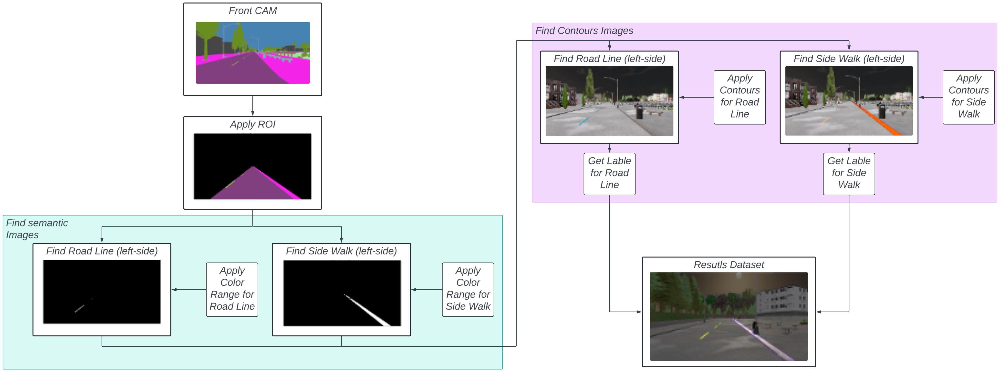

The pipeline collects paired RGB + semantic segmentation frames from the front camera and converts them into YOLO segmentation labels automatically:

1. **Front CAM** — subscribes to both `/carla/ego_vehicle/CAM_FRONT/image` (RGB) and `/carla/ego_vehicle/semantic_segmentation_front/image` (semantic)
2. **Apply ROI** — masks both images with the trapezoid polygon from `roi.yaml` to focus on the road ahead
3. **Find Semantic Images** — applies a color range filter on the semantic image to isolate each class:
   - **Road Line** (CARLA class 6) → binary mask for `left_marking`
   - **Side Walk** (CARLA class 8) → binary mask for `right_edge`
4. **Find Contour Images** — extracts pixel contours from each binary mask to form YOLO segmentation polygons
5. **Result Dataset** — saves the RGB frame + both polygon labels in YOLO format to `lka.yolo26/`

>[!NOTE]
> Make sure CARLA is running and the ROS bridge is already started before collecting data. Use **Clear weather** and **Low graphic** setting for consistent labels.

1. (Optional) Set ROI polygon — interactive click tool, press ENTER to confirm
```bash
python3 lka_ws/src/lka_dataset_collection/scripts/set_roi.py
# Output: lka_ws/src/lka_dataset_collection/config/roi.yaml
```

2. (Optional) Save one RGB + semantic sample to verify segmentation looks correct
```bash
source install/setup.bash &&
ros2 run lka_dataset_collection save_sem_sample.py
```

3. Enable CARLA autopilot so the vehicle drives automatically
```bash
ros2 topic pub --once /carla/ego_vehicle/enable_autopilot std_msgs/msg/Bool "{data: true}"
```

4. Start the dataset collector node
```bash
source install/setup.bash &&
ros2 run lka_dataset_collection dataset_collector_node.py
```
Stop with `Ctrl+C` when ~2000 images are collected.

Output will be saved to `lka.yolo26/` in YOLO segmentation format:
```
lka.yolo26/
├── images/
│   ├── train/
│   └── val/
├── labels/
│   ├── train/
│   └── val/
└── data.yaml
```

>[!NOTE]
> Two classes are labelled automatically from CARLA semantic segmentation:
> - **class 0** `left_marking` — RoadLine (CARLA class 6)
> - **class 1** `right_edge` — Sidewalk (CARLA class 8)

## YOLO

### How to Train YOLO
1. For trainning pls visit [train.ipynb](./training&process/train.ipynb)

2. For Testing pls visit [test.ipynb](./training&process/test.ipynb)

### How to Process YOLO output
For the step to find Lane center from YOLO output pls visit [yolo_process.ipynb](./training&process/yolo_process.ipynb)

| Clear | Fog | Night | Rain |
|---|---|---|---|
| 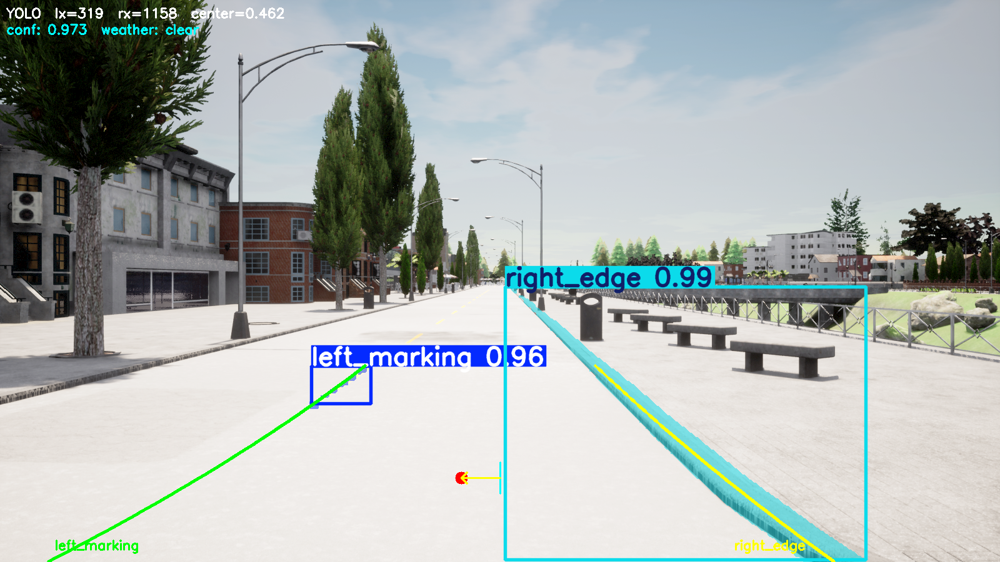 | 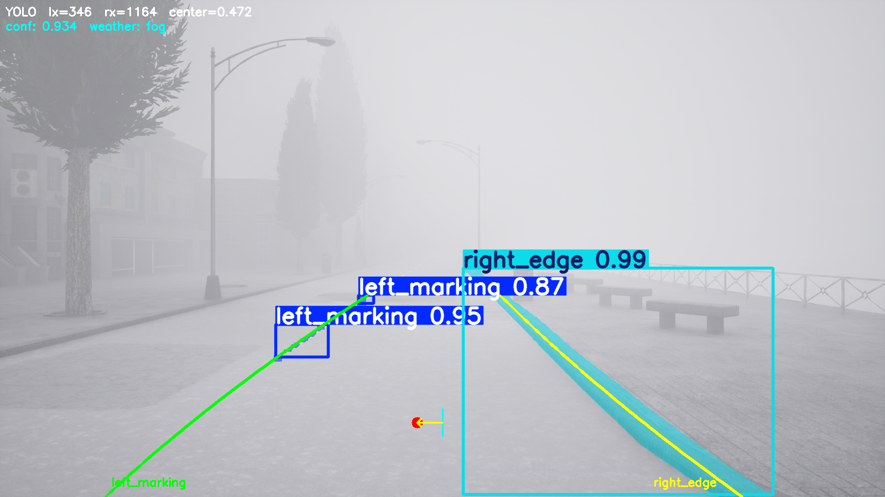 | 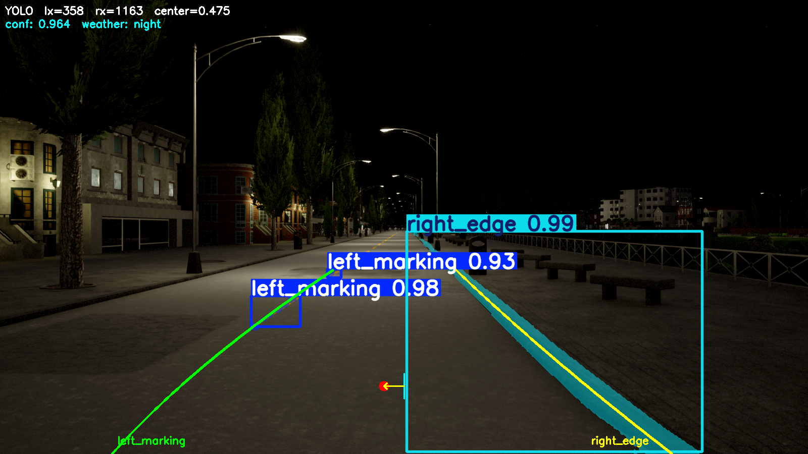 | 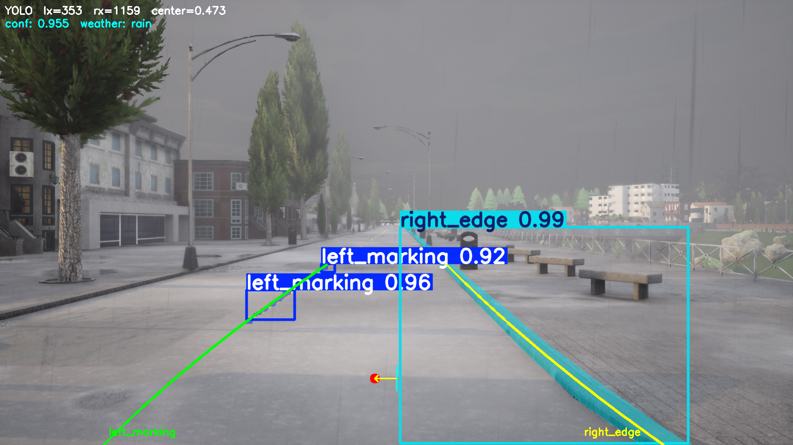 |


## Pure Vision (OpenCV)
### How to Process Pure Vision output

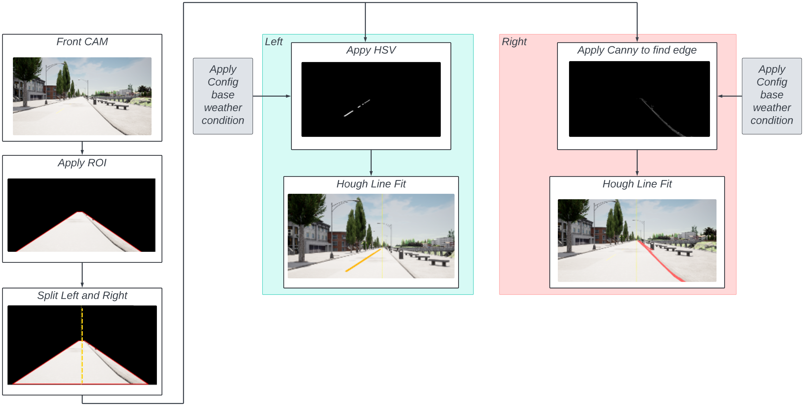

The Pure Vision pipeline processes the front camera image using classical OpenCV techniques, with weather-adaptive configs for each condition:

1. **Front CAM** — receives the raw RGB image from `/carla/ego_vehicle/CAM_FRONT/image`
2. **Apply ROI** — crops the image to the trapezoid region of interest, removing sky and irrelevant areas
3. **Split Left and Right** — divides the ROI at the centre column into two halves for independent processing

**Left side** (yellow dashed line = `left_marking`):
- **Apply HSV** — filters the left half with weather-specific HSV thresholds to isolate the yellow road line
- **Hough Line Fit** — fits a line through the detected yellow pixels to find the left lane boundary

**Right side** (red line = `right_edge`):
- **Apply Canny** — applies Canny edge detection with weather-specific thresholds to find the sidewalk/road edge on the right half
- **Hough Line Fit** — fits a line through the detected edge pixels to find the right lane boundary

Both fitted lines are evaluated at `y_ref` to get `lx` and `rx`, then the lane center is computed as `(lx + rx) / (2W)`.

For the step to find Lane center from Pure Vision output pls visit [pure_vision_process.ipynb](./training&process/pure_vision_process.ipynb)

| Clear | Fog | Night | Rain |
|---|---|---|---|
| 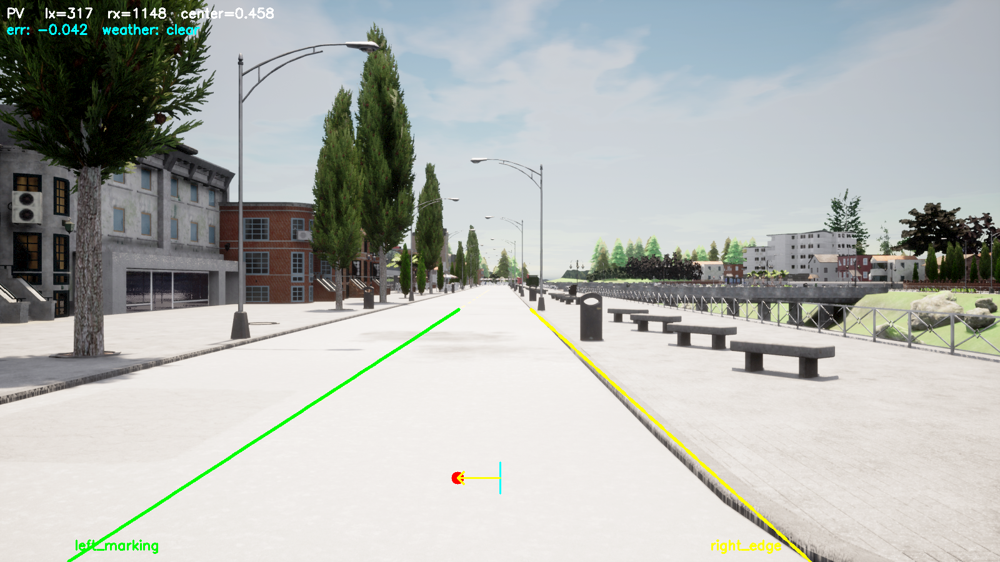 | 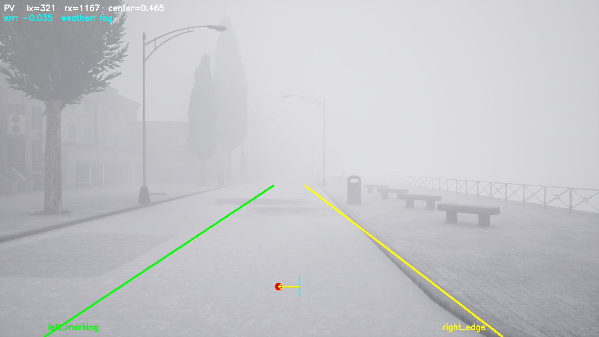 | 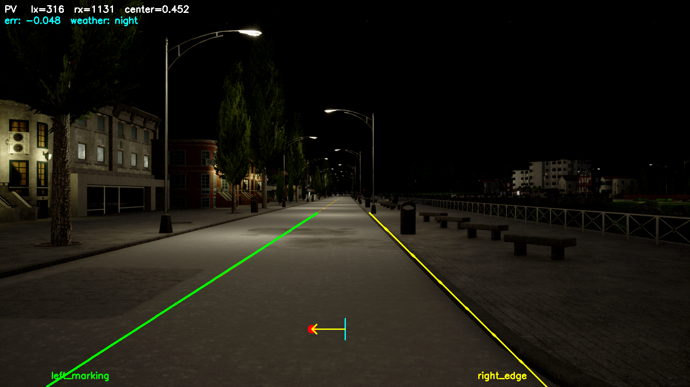 | 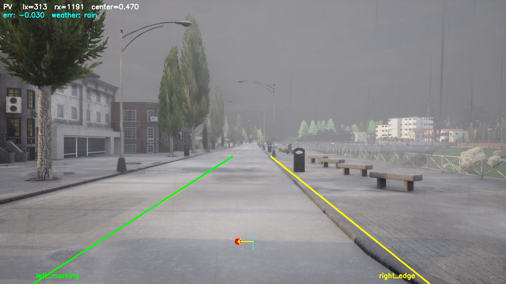 |


## SCNN

### How to Train SCNN

1. Git clone the SCNN repository

```bash
cd lka-carla
git clone https://github.com/voldemortX/pytorch-auto-drive.git
```

2. Convert YOLO dataset to SCNN format
>[!NOTE]
> Please make sure have the YOLO dataset you may dowload from [here](..) and put it in folder repo before run the command below.

```bash
python3 training&process/yolo2scnn.py
# Output: lka.scnn/
```

3. Register `LkaAsSegmentation` dataset class in pytorch-auto-drive

In `pytorch-auto-drive/utils/datasets/lane_as_segmentation.py` — add before the LLAMAS class:

```python
@DATASETS.register()
class LkaAsSegmentation(_StandardLaneDetectionDataset):
    colors = [[0, 0, 0], [255, 255, 0], [128, 128, 128]]

    def init_dataset(self, root):
        self.image_dir = root
        self.mask_dir = root
        self.splits_dir = os.path.join(root, 'list')
        self.output_prefix = './output'
        self.output_suffix = '.lines.txt'
        self.image_suffix = ''
        if not os.path.exists(self.output_prefix):
            os.makedirs(self.output_prefix)

    def _init_all(self):
        split_map = {'train': 'train_gt.txt', 'val': 'val_gt.txt'}
        split_f = os.path.join(self.splits_dir, split_map.get(self.image_set, self.image_set + '.txt'))
        with open(split_f, 'r') as f:
            contents = [x.strip() for x in f.readlines() if x.strip()]
        parts_list = [x.split() for x in contents]
        self.images = [os.path.join(self.image_dir, p[0]) for p in parts_list]
        self.masks  = [os.path.join(self.image_dir, p[1]) for p in parts_list]
        if self.test == 0:
            self.lane_existences = [[int(p[2]), int(p[3])] for p in parts_list]
```

In `pytorch-auto-drive/utils/datasets/__init__.py` — update the import line:

```python
from .lane_as_segmentation import TuSimpleAsSegmentation, CULaneAsSegmentation, LLAMAS_AsSegmentation, LkaAsSegmentation
```

4. Copy Config SCNN file to the SCNN repository

```bash
cp training&process/scnn_lka_config.py \
   pytorch-auto-drive/configs/lane_detection/scnn/resnet18_lka.py
```

5. Start training

```bash
cd pytorch-auto-drive
python main_landet.py --config configs/lane_detection/scnn/resnet18_lka.py --train
```

6. Test after training

```bash
python main_landet.py --config configs/lane_detection/scnn/resnet18_lka.py --test
```

### How to Process SCNN output

For the step to find Lane center from SCNN output pls visit [scnn_process.ipynb](./training&process/scnn_process.ipynb)


### How to find Lane center from All Perception Methods

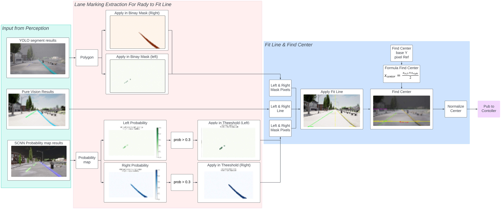

After getting lane pixels from each method (YOLO mask, Pure Vision Hough segments, or SCNN probability map), the center point is computed in 2 steps:

**Step 1 — Fit a line for each lane side using least squares**

For left and right side separately, fit a line $x = a \cdot y + b$ through the detected pixels:

$$c_x^L = a^L \cdot y_{ref} + b^L, \quad c_x^R = a^R \cdot y_{ref} + b^R$$

where $[a, b]$ are solved by minimizing:

$$[a, b] = \arg\min_{a,b} \sum_i \left( x_i - (a \cdot y_i + b) \right)^2$$

- $x_i$ : horizontal position of each lane pixel
- $y_i$ : vertical position of each lane pixel
- $a$ : slope of the fitted line
- $b$ : x-intercept ($x$ when $y = 0$)

**Step 2 — Compute normalized lane center**

$$\text{center} = \frac{c_x^L + c_x^R}{2W} \in [0, 1]$$

- $\text{center}$ : normalized lane center (0.0 = far left, 1.0 = far right, 0.5 = perfect center)
- $W$ : image width (1600 px)


## How to Save Test Experiment 1 and Experiment 2

### Experiment 1 — Perception Performance

>[!NOTE]
> Make sure CARLA is running and bridge is already started before running this experiment.

1. Launch all perception nodes
```bash
source install/setup.bash &&
ros2 launch lka_perception run_all_perception.launch.py
```

2. Start recording bag — it will auto-cycle Rain → Clear → Fog → Night (60 s each)
```bash
source install/setup.bash &&
ros2 launch lka_bringup record_bag.launch.py
```
Wait ~4 minutes until all 4 weather conditions finish, then `Ctrl+C` to stop.

Bag will be saved to `bags/<timestamp>/`

3. Evaluate
```bash
python3 analysis/eval_perception.py bags/<bag_name>/
```
Results saved to `analysis/results/perception/`

### Experiment 2 — Controller Performance

>[!IMPORTANT]
> Make sure CARLA is running and bridge is already started before running this experiment.

1. Run automated trials (3 methods × 4 weathers × 3 repeats = 36 trials)
```bash
python3 lka_ws/src/lka_bringup/scripts/run_trials.py
```
Bags will be saved to `bags/closed_loop/`

You can also run a subset:
```bash
# Only specific methods or weathers
python3 lka_ws/src/lka_bringup/scripts/run_trials.py --methods yolo --weathers clear rain
# Preview plan without running
python3 lka_ws/src/lka_bringup/scripts/run_trials.py --dry-run
```

2. Evaluate
```bash
python3 analysis/eval_controller.py bags/closed_loop/
```
Results saved to `analysis/results/controller/`

## Results

### Experiment 1 — Perception Performance

**Setup**: CARLA Town01, Tesla Model 3, 1600×900 front camera, 60 s per weather condition, vehicle stationary.

All 3 methods achieved **100% detection rate** across all weather conditions.

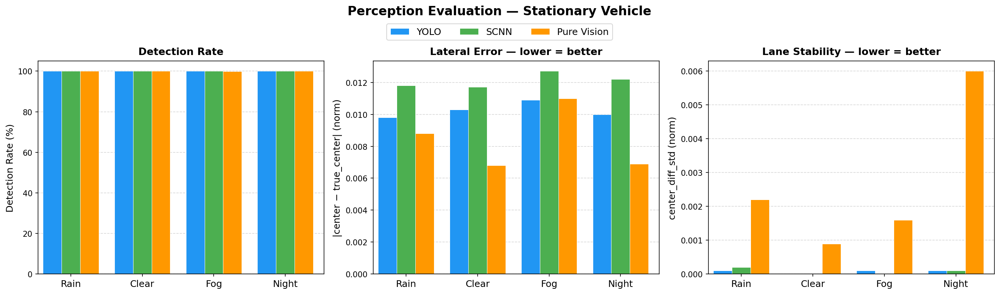

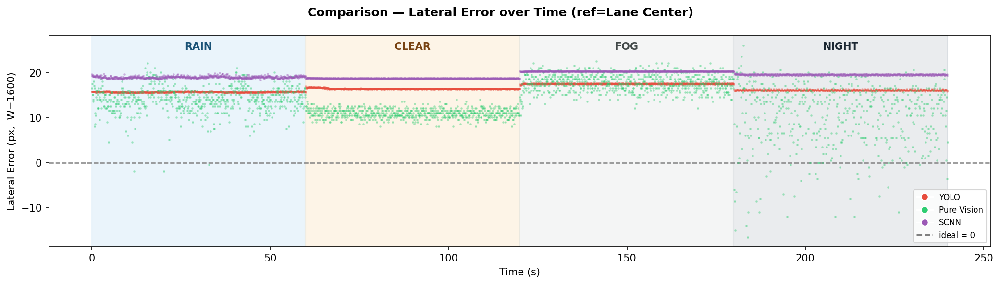

| Weather | YOLO RMSE (px) | YOLO Jitter σ (px) | Pure Vision RMSE (px) | Pure Vision Jitter σ (px) | SCNN RMSE (px) | SCNN Jitter σ (px) |
|---------|---------------|-------------------|----------------------|--------------------------|---------------|-------------------|
| Clear   | 16.8          | 0.00              | 10.7                 | 1.44                     | 17.9          | 0.00              |
| Rain    | 16.6          | 0.16              | 14.2                 | 3.04                     | 17.1          | 0.32              |
| Fog     | 18.4          | 0.16              | 17.8                 | 2.72                     | 18.6          | 0.00              |
| Night   | 16.8          | 0.16              | 11.0                 | 11.20                    | 17.9          | 0.32              |

- **RMSE (px)** = `err_mean × 1600` — lateral error from ground-truth lane center
- **Jitter σ (px)** = `center_diff_std × 1600` — std of frame-to-frame center jump (lower = more stable)

**Key findings:**
- Pure Vision has the lowest RMSE in Clear (10.7 px) and Night (11.0 px) but extremely high night jitter (11.20 px) due to right-edge instability
- SCNN is the most stable overall — jitter σ ≤ 0.32 px across all conditions
- YOLO is the most consistent across weather — RMSE varies only 1.8 px across all conditions

### Experiment 2 — Controller Performance

**Setup**: CARLA Town01, Tesla Model 3, Pure Pursuit (throttle=0.3), hysteresis ON, 3 repeats per condition (36 trials total).

All 3 methods achieved **0% off-lane rate** across all trials.

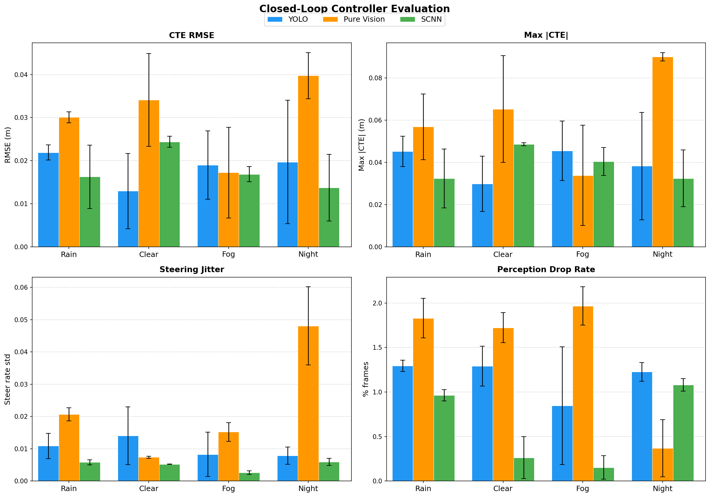

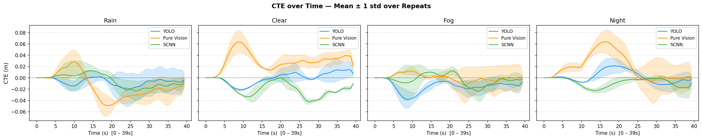

| Weather | YOLO CTE RMSE (cm) | YOLO Steer Jitter (%) | Pure Vision CTE RMSE (cm) | Pure Vision Steer Jitter (%) | SCNN CTE RMSE (cm) | SCNN Steer Jitter (%) |
|---------|-------------------|-----------------------|--------------------------|-----------------------------|--------------------|----------------------|
| Clear   | 1.30              | 1.41                  | 3.41                     | 0.74                        | 2.44               | 0.52                 |
| Rain    | 2.19              | 1.09                  | 3.01                     | 2.07                        | 1.63               | 0.58                 |
| Fog     | 1.90              | 0.83                  | 1.72                     | 1.52                        | 1.69               | 0.26                 |
| Night   | 1.97              | 0.79                  | 3.97                     | 4.81                        | 1.37               | 0.59                 |

- **CTE RMSE (cm)** = `cte_rmse_mean × 100` — cross-track error from GT node
- **Steer Jitter (%)** = `steer_jitter_mean × 100` — std of steering command changes (lower = smoother)

**Key findings:**
- YOLO achieves the best CTE in Clear (1.30 cm) but highest steer jitter in Clear (1.41%)
- SCNN achieves the best CTE in Night (1.37 cm) and Rain (1.63 cm) with consistently low steer jitter (≤ 0.59%)
- Pure Vision has the highest night CTE (3.97 cm) and steer jitter (4.81%) — caused by right-edge instability under low light
- Fog is the most balanced condition — all 3 methods within 0.18 cm CTE of each other

## References

1. A. Dosovitskiy, G. Ros, F. Codevilla, A. Lopez, and V. Koltun, "CARLA: An Open Urban Driving Simulator," in *Proc. Conference on Robot Learning (CoRL)*, 2017. [Online]. Available: [https://doi.org/10.48550/arXiv.1712.06080](https://doi.org/10.48550/arXiv.1712.06080)

2. G. Jocher, A. Chaurasia, and J. Qiu, "Ultralytics YOLO," 2023. [Online]. Available: [https://github.com/ultralytics/ultralytics](https://github.com/ultralytics/ultralytics)

3. Q. Zheng, R. Yang, and Z. Zhou, "pytorch-auto-drive: A unified framework for lane detection," 2021. [Online]. Available: [https://github.com/voldemortX/pytorch-auto-drive](https://github.com/voldemortX/pytorch-auto-drive)

4. MathWorks, "Pure Pursuit Controller," *Navigation Toolbox Documentation*, [Online]. Available: [https://www.mathworks.com/help/nav/ug/pure-pursuit-controller.html](https://www.mathworks.com/help/nav/ug/pure-pursuit-controller.html)

