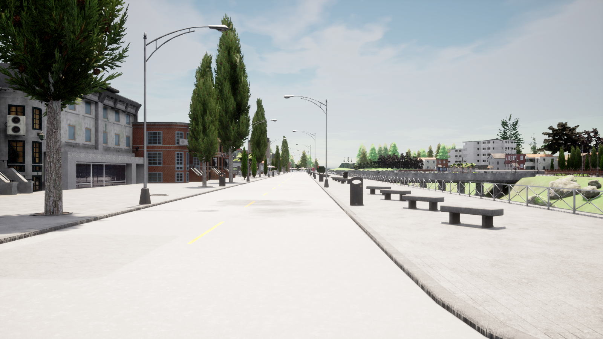
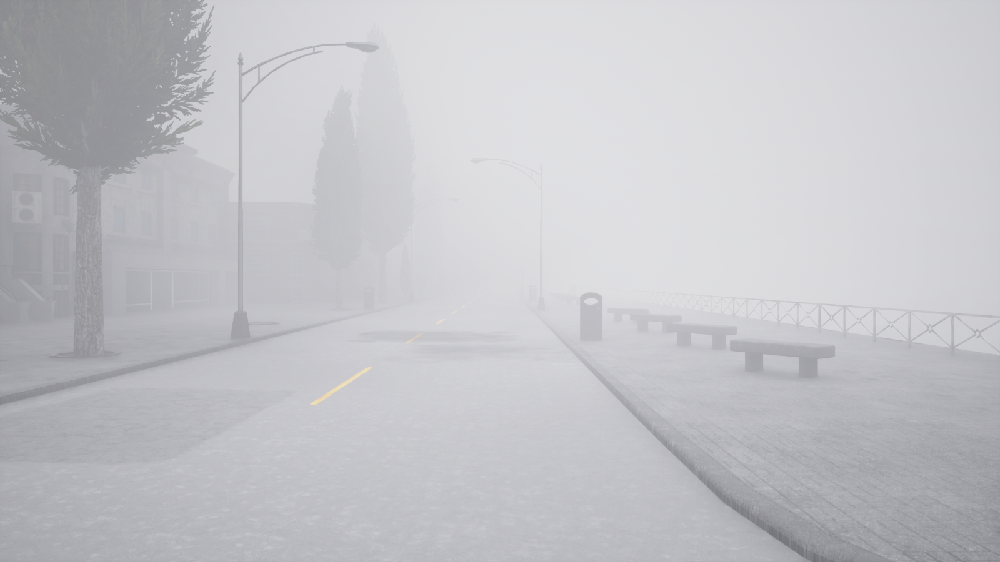
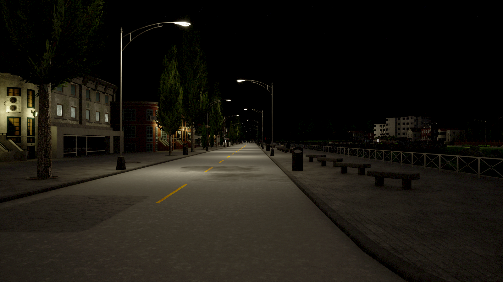
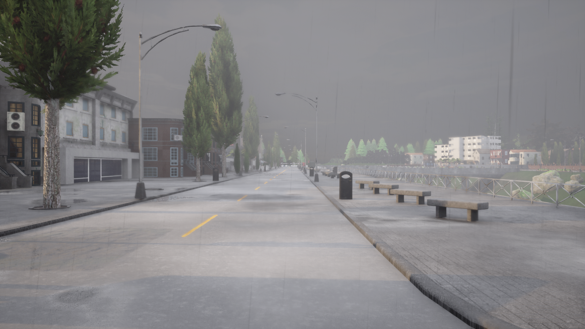
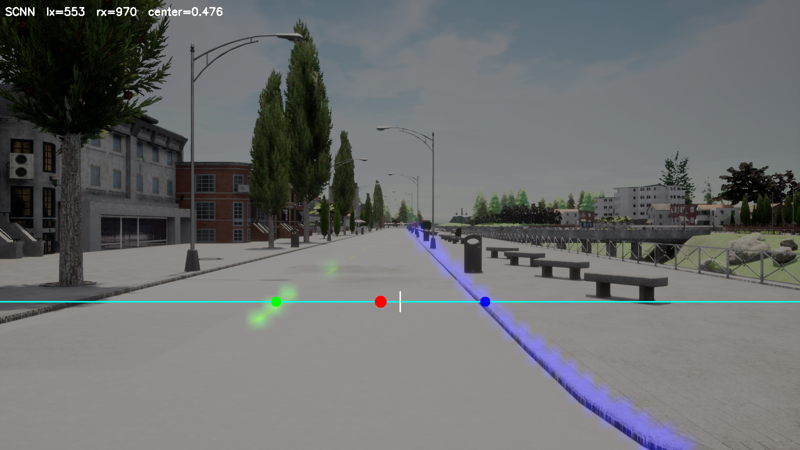
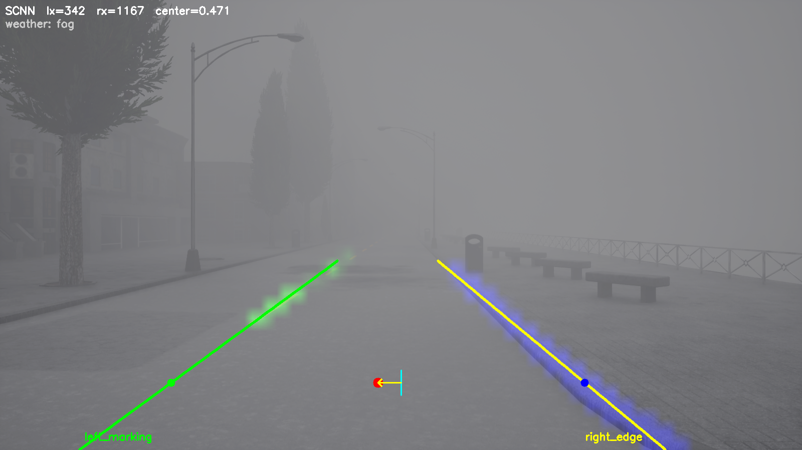
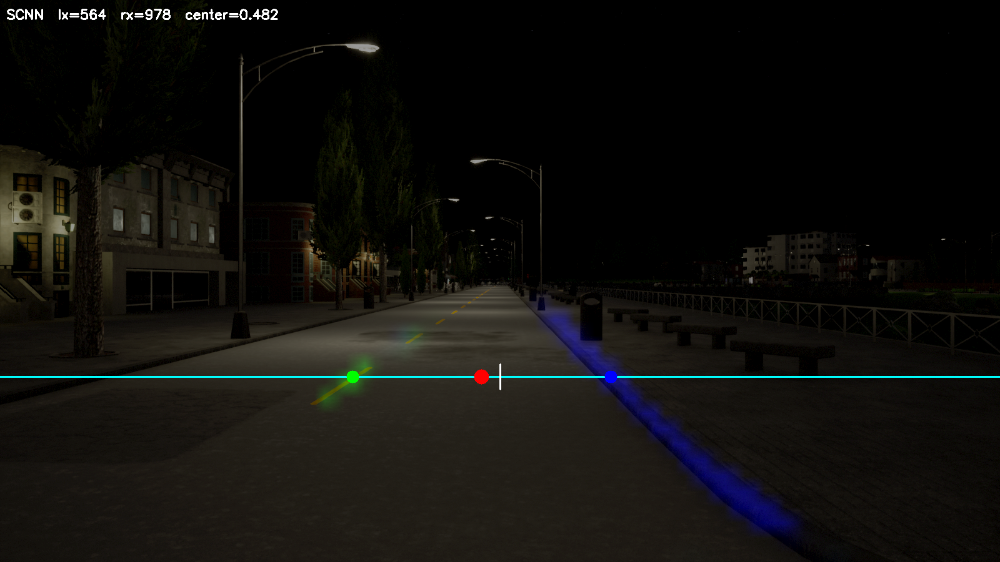
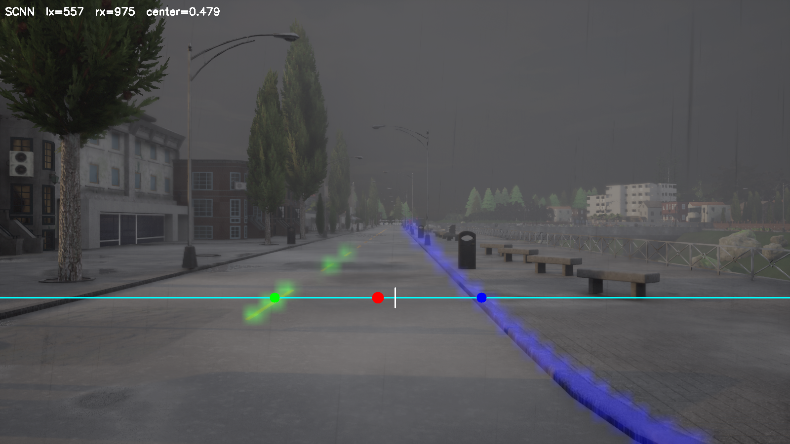
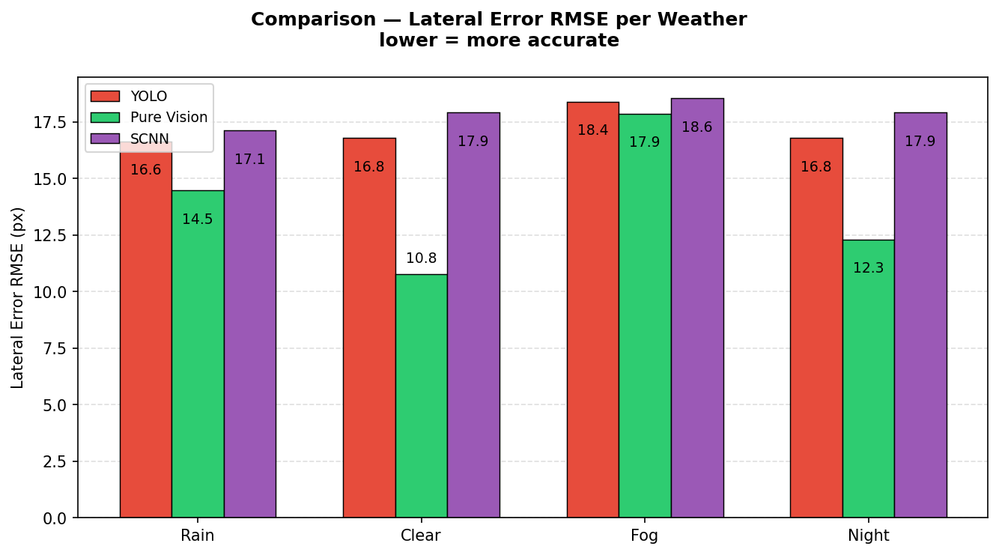
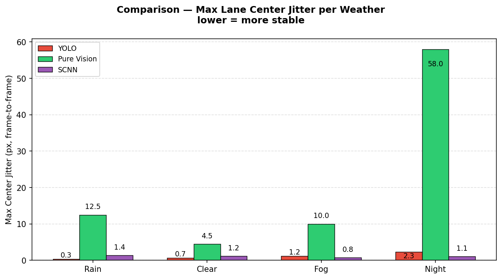

ชื่อโครงการ Vision-Based Lane Keeping Assist System on CARLA Simulator

จัดทำโดย

กลุ่ม Peeradon

|  |  |
| --- | --- |
| ชื่อ – นามสกุล | เลขประจำตัว |
| นาย พีรดนย์ เรืองแก้ว | 67340700403 |

FRA626 Machine Vision for Smart Factory

สถาบันวิทยาการหุ่นยนต์ภาคสนาม

มหาวิทยาลัยเทคโนโลยีพระจอมเกล้าธนบุรี

ภาคการเรียนปลาย ปีการศึกษา 2568

---

# **ที่มาและความสำคัญ**

ระบบช่วยรักษาตำแหน่งในเลน (Lane Keeping Assist — LKA) เป็นฟีเจอร์ความปลอดภัยสำคัญในยานยนต์อัตโนมัติ ซึ่งต้องการการตรวจจับเลนที่แม่นยำและทำงานแบบ Real-time อย่างไรก็ตาม การตรวจจับเลนในสภาพแวดล้อมจริงที่มีการเปลี่ยนแปลงของสภาพอากาศ เช่น ฝน หมอก และกลางคืน ยังคงเป็นปัญหาที่ท้าทายในด้าน Computer Vision

โครงงานนี้จึงพัฒนาและเปรียบเทียบวิธีตรวจจับเลน 3 วิธี ได้แก่ YOLO (Instance Segmentation), Pure Vision (OpenCV) และ SCNN (Spatial CNN) ภายใน CARLA Simulator เพื่อหาวิธีที่เหมาะสมที่สุดสำหรับสภาพอากาศที่แตกต่างกัน และนำ Pure Pursuit Controller มาควบคุมให้รถรักษาตำแหน่งกึ่งกลางเลน

---

# **วัตถุประสงค์**

1. พัฒนา Lane Detection Pipeline โดยใช้ YOLO, Pure Vision (OpenCV) และ SCNN ภายใน CARLA Simulator
2. นำผลลัพธ์การตรวจจับมาคำนวณจุดกึ่งกลางเลน (Lane Center) เพื่อส่งให้ Pure Pursuit Controller
3. ทดสอบและเปรียบเทียบประสิทธิภาพของทั้ง 3 วิธีภายใต้สภาพอากาศ 4 แบบ ได้แก่ Clear, Rain, Fog และ Night

---

# **การออกแบบและพัฒนา**

## เทคโนโลยีและเครื่องมือที่ใช้พัฒนา

| เครื่องมือ | รายละเอียด |
|---|---|
| CARLA Simulator v0.9.16 | สภาพแวดล้อมจำลองสำหรับ Autonomous Driving |
| ROS2 Humble | Middleware สำหรับสื่อสารระหว่าง Node |
| Ultralytics YOLO (yolo26l-seg.pt) | โมเดล Instance Segmentation |
| pytorch-auto-drive | Framework สำหรับฝึกและใช้งาน SCNN |
| OpenCV | ประมวลผลภาพสำหรับ Pure Vision (HSV + Canny + Hough) |
| NVIDIA GeForce RTX 5070 Ti | GPU สำหรับฝึกโมเดล |
| Python 3 + NumPy | ประมวลผลข้อมูลและคำนวณ Lane Center |

## ขอบเขตของงาน (Scope of Work)

1. ตรวจจับและทดสอบเฉพาะทิศทางเดินหน้า (Forward Lane Direction)
2. พัฒนาและทดสอบบน ROS2 เป็น Middleware หลัก
3. ทดสอบในสภาพแวดล้อมจำลอง CARLA เท่านั้น
4. ใช้รถจำลองจาก CARLA (Tesla Model 3)

## System Overview

ระบบประกอบด้วย 3 ส่วนหลัก ได้แก่ **Perception**, **Control** และ **Evaluation** โดยกล้องหน้าของรถจะส่งภาพเข้าสู่โหนด Perception ที่เลือกใช้งาน (YOLO, Pure Vision หรือ SCNN) ซึ่งทำหน้าที่ตรวจจับเส้นเลนและคำนวณตำแหน่งกึ่งกลางของเลน (Normalized Lane Center) จากนั้นส่งต่อไปยัง Pure Pursuit Controller เพื่อคำนวณมุมเลี้ยวและควบคุมรถใน CARLA Simulator ในส่วนของ Evaluation ระบบใช้ GT Node ที่โหลดแผนที่ Town01 จาก CARLA เพื่อคำนวณ Cross-Track Error จริง สำหรับวัดประสิทธิภาพของแต่ละวิธีในสภาพอากาศทั้ง 4 แบบ

สภาพอากาศ 4 แบบ (Clear, Rain, Fog, Night) ถูกกำหนดผ่าน CARLA Simulator API

| สภาพอากาศ | ตัวอย่าง |
|---|---|
| Clear |  |
| Fog |  |
| Night |  |
| Rain |  |

## การเก็บ Dataset

- เก็บ **2,000 ภาพ** จากกล้องหน้า 1600×900 px ใน CARLA Town01
- ใช้สภาพอากาศ **Clear** และ **Low graphic setting**
- เปิด CARLA Autopilot ให้รถขับอัตโนมัติระหว่างเก็บข้อมูล

**Lane Marking Extraction Pipeline:**

1. รับภาพ RGB และ Semantic Segmentation จากกล้องหน้าพร้อมกัน
2. Apply ROI polygon เพื่อตัดบริเวณท้องฟ้าและพื้นที่ไม่เกี่ยวข้องออก
3. จาก Semantic image ใช้ Color Range แยก class:
   - **RoadLine** (CARLA class 6) → **left_marking** (class 0)
   - **Sidewalk** (CARLA class 8) → **right_edge** (class 1)
4. Find Contours เพื่อสร้าง Polygon Label ในรูปแบบ YOLO Segmentation
5. บันทึก label ในรูปแบบ YOLO Segmentation และ SCNN Segmentation

## YOLO

**Model:** yolo26l-seg.pt (Instance Segmentation)

| Parameters | Value | Meaning |
|---|---|---|
| epochs | 100 | Training rounds |
| imgsz | 640 | Input image size |
| batch | 16 | Images per step |
| patience | 30 | Early stop threshold |

**ผลการ Train:** Confidence 0.85–0.99 ในทุกสภาพอากาศ ตรวจจับได้ทั้งเส้นซ้าย (left_marking) และขอบขวา (right_edge) อย่างชัดเจน

| Clear | Fog | Night | Rain |
|---|---|---|---|
|  |  |  |  |

## Pure Vision (OpenCV)

ประมวลผลภาพจากกล้องหน้าโดยใช้ Classical CV โดยแยกซ้าย-ขวาด้วย Config ที่ปรับตามสภาพอากาศ:

- **ฝั่งซ้าย (left_marking):** กรองสีเหลืองด้วย HSV Filter ตามสภาพอากาศ จากนั้น Fit เส้นด้วย Hough Transform
- **ฝั่งขวา (right_edge):** ตรวจหาขอบด้วย Canny Edge Detection จากนั้น Fit เส้นด้วย Hough Transform

| Weather | HSV_LO | HSV_HI | Canny |
|---|---|---|---|
| Clear | [10, 30, 250] | [40, 120, 255] | (30, 90) |
| Fog | [10, 5, 180] | [40, 120, 255] | (20, 60) |
| Night | [10, 150, 30] | [40, 255, 255] | (20, 60) |
| Rain | [15, 25, 150] | [35, 255, 255] | (20, 60) |

| Clear | Fog | Night | Rain |
|---|---|---|---|
|  |  |  |  |

## SCNN (Spatial CNN)

**What is SCNN?** SCNN ส่ง Message ผ่าน Slice ของ Feature Map ใน 4 ทิศทาง (Down, Up, Right, Left) ทำให้ Pixel ที่อยู่ในเลนเดียวกันแต่ห่างกันสามารถแชร์ข้อมูลกันได้ภายใน Layer เดียวกัน ต่างจาก CNN ทั่วไปที่แต่ละ Pixel รับข้อมูลได้เฉพาะ Patch เล็กๆ รอบตัวมันเท่านั้น

**Architecture:** ResNet-18 backbone + SpatialConv (pytorch-auto-drive)

| Clear | Fog | Night | Rain |
|---|---|---|---|
|  |  |  |  |

| Parameters | Value | Meaning |
|---|---|---|
| epochs | 100 | Training rounds |
| Input size | 288 × 800 | H × W |
| batch | 32 | Images per step |
| optimizer | SGD | lr=0.01, momentum=0.9 |
| pretrained | True | ResNet-18 from ImageNet |
| NUM_CLASSES | 3 | bg, left_marking, right_edge |

## Find Center Point

หลังจากได้ Lane Pixel จากแต่ละวิธี (YOLO mask, Pure Vision Hough segments, SCNN probability map) ใช้สูตรเดียวกันทุกวิธี:

**Step 1 — Fit line ด้วย Least Squares สำหรับแต่ละฝั่ง**

$$[a, b] = \arg\min_{a,b} \sum_i \left( x_i - (a \cdot y_i + b) \right)^2$$

$$c_x^L = a^L \cdot y_{ref} + b^L, \quad c_x^R = a^R \cdot y_{ref} + b^R$$

**Step 2 — คำนวณ Normalized Lane Center**

$$\text{center} = \frac{c_x^L + c_x^R}{2W} \in [0, 1]$$

- center = 0.5 หมายถึงรถอยู่กึ่งกลางเลนพอดี
- W = ความกว้างภาพ (1600 px)

## Pure Pursuit Controller

| Symbol | Value | Unit | Description |
|---|---|---|---|
| k | 2.4 | — | Lookahead gain (ld_velocity_ratio) |
| L | 3.0046 | m | Wheel base |
| W_lane | 3.5 | m | Lane width |
| δ_max | 1.2217 | rad | Maximum steering angle |
| throttle | 0.3 | — | Constant throttle |

**สูตรคำนวณ:**

$$e = (c_{norm} - 0.5) \times W_{lane}$$
$$\kappa = \frac{2e}{l_d^2}, \quad l_d = k \cdot v$$
$$\delta = \arctan(L \cdot \kappa)$$
$$\delta_{norm} = \text{clip}\left(\frac{\delta}{\delta_{max}}, -1, 1\right)$$

## Hysteresis Filter

บางเฟรมไม่สามารถตรวจจับเลนได้เนื่องจาก:
- SCNN: Probability map ต่ำกว่า threshold
- YOLO: Confidence ต่ำ
- Pure Vision: Hough ไม่สามารถ Fit Line ได้

ส่งผลให้ Lane Center ไม่เสถียร → Steering สั่น

**วิธีแก้:** Hysteresis Filter
- ต้องการ **3 เฟรมดีติดต่อกัน** เพื่อเข้าสู่ TRACKING state
- ถือ center ล่าสุดที่ดีไว้ได้สูงสุด **5 เฟรมเลว**ก่อนกลับสู่ SEARCHING state
- "เฟรมดี" คือเฟรมที่ตรวจจับเลนสำเร็จและค่า Lane Center เปลี่ยนแปลงจากเฟรมก่อนหน้าไม่เกิน 0.12 (normalized)

---

# **การใช้งานและผลการทดสอบ**

## Experiment 1 — Perception Performance

**Objective:** เปรียบเทียบความแม่นยำและเสถียรภาพของ Lane Center ทั้ง 3 วิธีภายใต้ 4 สภาพอากาศ (Vehicle หยุดนิ่ง, 60 วินาที/สภาพอากาศ)

**Metrics:**

$$\text{Det Rate} = \frac{\text{detected frames}}{\text{total frames}} \times 100$$

$$\text{RMSE} = \sqrt{\frac{1}{N}\sum_{i=1}^{N}(center_i - true\_center_i)^2} \times 1600 \text{ (px)}$$

$$\text{Max Jitter} = \max(|center_t - center_{t-1}|) \times 1600 \text{ (px)}$$

**ผลการทดสอบ:**

| Weather | YOLO Det (%) | YOLO RMSE (px) | YOLO Max Jitter (px) | PV Det (%) | PV RMSE (px) | PV Max Jitter (px) | SCNN Det (%) | SCNN RMSE (px) | SCNN Max Jitter (px) |
|---------|:---:|:---:|:---:|:---:|:---:|:---:|:---:|:---:|:---:|
| Clear | 100 | 16.8 | 0.7 | 100 | **10.8** | 4.5 | 100 | 17.9 | 1.2 |
| Rain  | 100 | **16.6** | 0.3 | 100 | 14.5 | 12.5 | 100 | 17.1 | 1.4 |
| Fog   | 100 | 18.4 | 1.2 | 100 | 17.9 | 10.0 | 100 | 18.6 | **0.8** |
| Night | 100 | 16.8 | **2.3** | 100 | 12.3 | **58.0** | 100 | 17.9 | 1.1 |

**สรุป Exp 1:**
- ทุกวิธีมี Detection Rate 100% ในทุกสภาพอากาศ
- **Pure Vision** มี RMSE ต่ำสุดใน Clear (10.8 px) และ Night (12.3 px) แต่ Max Jitter กลางคืนพุ่งสูงถึง **58 px** เนื่องจาก right_edge ไม่เสถียร
- **YOLO** มี RMSE สม่ำเสมอที่สุด (16.6–18.4 px) โดย Jitter ไม่เกิน 2.3 px ในทุกสภาพอากาศ
- **SCNN** เสถียรที่สุดโดยรวม โดย Max Jitter ไม่เกิน 1.4 px แต่มี RMSE สูงที่สุดในทุกสภาพอากาศ

## Experiment 2 — Controller Performance (Closed-Loop)

**Objective:** ประเมินว่า Lane Center Output ของแต่ละวิธีส่งผลต่อพฤติกรรม Pure Pursuit Controller และ Lane Keeping อย่างไรภายใต้ 4 สภาพอากาศ (3 repeats × 3 methods × 4 weathers = 36 trials)

**Metrics:**

$$\text{CTE RMSE} = \sqrt{\frac{1}{N}\sum_{i=1}^{N} cte_i^2} \times 100 \text{ (cm)}$$

$$\text{Max Steer Jitter} = \max(|\delta_t - \delta_{t-1}|) \times 100 \text{ (\%)}$$

**ผลการทดสอบ:**

| Weather | YOLO CTE (cm) | YOLO Steer J (%) | PV CTE (cm) | PV Steer J (%) | SCNN CTE (cm) | SCNN Steer J (%) |
|---------|:---:|:---:|:---:|:---:|:---:|:---:|
| Clear | **1.30** | 1.41 | 3.41 | 0.74 | 2.44 | 0.52 |
| Rain  | 2.19 | 1.09 | 3.01 | 2.07 | **1.63** | **0.58** |
| Fog   | 1.90 | 0.83 | 1.72 | 1.52 | **1.69** | **0.26** |
| Night | 1.97 | 0.79 | 3.97 | 4.81 | **1.37** | **0.59** |

**สรุป Exp 2:**
- ทุกวิธีมี Off-lane Rate **0%** ในทุกการทดสอบ
- **YOLO** มี CTE ต่ำสุดใน Clear (1.30 cm) แต่มี Steer Jitter สูงที่สุดใน Clear (1.41%)
- **SCNN** มี CTE ต่ำสุดใน Night (1.37 cm) และ Rain (1.63 cm) พร้อมกับ Steer Jitter สม่ำเสมอต่ำ (≤ 0.59%)
- **Pure Vision** มี CTE และ Steer Jitter สูงที่สุดกลางคืน (3.97 cm, 4.81%) เนื่องจาก right_edge ไม่เสถียรในแสงน้อย
- สภาพอากาศ Fog เป็นสภาพที่ทุกวิธีทำได้ใกล้เคียงกันมากที่สุด (CTE ต่างกันไม่เกิน 0.18 cm)

---

# **ปัญหาที่พบและแนวทางแก้ไข**

| ปัญหา | สาเหตุ | แนวทางแก้ไข |
|---|---|---|
| Lane Center ไม่เสถียรในบางเฟรม | โมเดลไม่สามารถตรวจจับเลนได้ในบางเฟรม ส่งผลให้ค่ากลางเลนขาดหายหรือกระโดด | เพิ่ม Hysteresis Filter โดยต้องการ 3 เฟรมดีติดต่อกันก่อนเข้าสู่ Tracking และทนเฟรมเสียได้สูงสุด 5 เฟรม |
| Pure Vision กลางคืน Max Jitter สูงถึง 58 px | แสงน้อยทำให้ Canny ตรวจจับขอบขวาผิดพลาด | ปรับ HSV Threshold และ Canny Threshold เฉพาะสภาพกลางคืน |
| SCNN โหลดโมเดลล้มเหลวเมื่อเริ่มระบบ | มีอักขระพิเศษแทรกอยู่ต่อท้าย Path ของไฟล์ weights ใน config | แก้ไข Path ให้ถูกต้องใน config file |
| SCNN output มี offset จาก true center | Dataset ฝึกในสภาพอากาศ Clear และ Low Graphic Setting เท่านั้น ไม่ครอบคลุม High Graphic | ยอมรับ offset คงที่ เนื่องจาก RMSE อยู่ในช่วงที่ยอมรับได้ |

---

# **สรุปและข้อเสนอแนะในการพัฒนาต่อในอนาคต**

## สรุป

โครงงานนี้พัฒนาและเปรียบเทียบ Lane Detection 3 วิธีสำหรับ LKA ใน CARLA Simulator:

- **YOLO** เหมาะสมที่สุดสำหรับสภาพอากาศที่หลากหลาย เนื่องจาก RMSE สม่ำเสมอและ CTE ต่ำที่สุดใน Clear weather
- **SCNN** เหมาะสมที่สุดสำหรับความเสถียรโดยรวม โดยเฉพาะ Night และ Rain ซึ่ง CTE ต่ำที่สุดและ Steer Jitter ต่ำ
- **Pure Vision** เป็นวิธีที่ไม่ต้องฝึกโมเดลและให้ RMSE ต่ำสุดใน Clear/Night แต่ไม่เสถียรในสภาพแสงน้อย
- ทุกวิธีผ่านการทดสอบโดยไม่มีการออกนอกเลนเลย (0% Off-lane Rate)

## ข้อเสนอแนะในการพัฒนาต่อ

1. เพิ่ม Dataset ในสภาพอากาศต่างๆ (Rain, Fog, Night) เพื่อให้ YOLO และ SCNN generalise ได้ดีขึ้น
2. รวม Kalman Filter สำหรับ Lane Center Smoothing แทน Hysteresis Filter
3. ขยายการทดสอบไปยัง Town อื่นๆ ใน CARLA (multi-lane, curved road)
4. พัฒนา Adaptive Controller ที่ปรับ lookahead distance ตามความเร็วและสภาพอากาศ
5. ทดสอบกับ Real-world dataset เช่น TuSimple หรือ CULane

---

# **สิ่งที่ได้เรียนรู้**

## บทความที่สืบค้น ทดลอง เรียนรู้ พร้อมแนวทางในการใช้งาน

| หัวข้อ | สิ่งที่เรียนรู้ |
|---|---|
| SCNN Architecture | เข้าใจหลักการ Spatial Message Passing ใน 4 ทิศทาง และความแตกต่างจาก CNN ทั่วไปในการ capture long-range dependency |
| YOLO Instance Segmentation | การ train และ deploy YOLO seg model, การอ่าน mask output และแปลงเป็น pixel coordinates |
| Dataset Pipeline | การสร้าง Auto-labelling pipeline จาก CARLA Semantic Segmentation โดยไม่ต้อง label ด้วยมือ |
| ROS2 Node Design | การออกแบบโหนดสื่อสารใน ROS2 รวมถึงการส่งข้อมูลระหว่างโหนด การสร้าง Custom Message และการ Remap Topic ให้ระบบทำงานร่วมกันได้ |
| Pure Pursuit Algorithm | หลักการคำนวณ Lookahead Point สูตร Curvature และ Steering Angle และผลกระทบของค่า Lookahead Distance ต่อพฤติกรรมการควบคุม |
| Hysteresis State Machine | การออกแบบ State Machine สำหรับกรองสัญญาณชั่วคราวเพื่อรักษาเสถียรภาพของ Output ในกรณีที่ตรวจจับล้มเหลวบางเฟรม |
| Evaluation Metrics | การเลือกและตีความ RMSE, Max Jitter, CTE RMSE และ Steer Jitter สำหรับประเมินประสิทธิภาพของ Perception และ Controller |
| Bag Recording & Analysis | การบันทึกข้อมูล Sensor และ Control ระหว่างการทดสอบ และการวิเคราะห์ผลด้วยการประมวลผลข้อมูลเชิงตาราง |

---

# **ลิงค์ Source code**

[https://github.com/peeradonmoke2002/lka-carla](https://github.com/peeradonmoke2002/lka-carla)

---

# **เอกสารอ้างอิง**

1. A. Dosovitskiy, G. Ros, F. Codevilla, A. Lopez, and V. Koltun, "CARLA: An Open Urban Driving Simulator," in *Proc. Conference on Robot Learning (CoRL)*, 2017. Available: https://doi.org/10.48550/arXiv.1712.06080

2. G. Jocher, A. Chaurasia, and J. Qiu, "Ultralytics YOLO," 2023. Available: https://github.com/ultralytics/ultralytics

3. Q. Zheng, R. Yang, and Z. Zhou, "pytorch-auto-drive: A unified framework for lane detection," 2021. Available: https://github.com/voldemortX/pytorch-auto-drive

4. MathWorks, "Pure Pursuit Controller," *Navigation Toolbox Documentation*. Available: https://www.mathworks.com/help/nav/ug/pure-pursuit-controller.html

---

# **รายชื่อสมาชิกและหน้าที่ที่รับผิดชอบ**

|  | **ชื่อ – นามสกุล** | **ความรับผิดชอบในทีม** |
| --- | --- | --- |
| 1 | นาย พีรดนย์ เรืองแก้ว (67340700403) | ทุกส่วน (Dataset Collection, YOLO, Pure Vision, SCNN, Controller, Evaluation) |

---

# **การใช้งานเครื่องมือปัญญาประดิษฐ์**

"รายวิชานี้อนุญาตและส่งเสริมให้ใช้เครื่องมือ AI เป็นผู้ช่วยในการสืบค้นข้อมูล เขียนโค้ดและแก้ไขบั๊ก (Debugging) แต่ นักศึกษาจะต้องเป็นผู้รับผิดชอบต่อโค้ดทุกบรรทัดที่อยู่ในโปรเจกต์ หากมีการตรวจพบว่าโค้ดส่วนใดเกิดข้อผิดพลาด หรือนักศึกษาไม่สามารถอธิบายการทำงานของโค้ดที่ AI สร้างขึ้นมาระหว่างการสอบนำเสนอ (Project Pitching) ได้ จะมีผลต่อคะแนนโดยตรง"

กลุ่มของข้าพเจ้าขอรับรองว่า ในการจัดทำโครงงานนี้ มีการใช้งานเครื่องมือ AI (เช่น ChatGPT, Gemini, GitHub Copilot, Claude ฯลฯ) เพื่อช่วยในการพัฒนา โดยมีรายละเอียดความโปร่งใสดังต่อไปนี้:

**1. เครื่องมือ AI ที่ใช้งาน (AI Tools Used):**

- Claude Code (Anthropic) — ช่วยเขียนโค้ด ROS2, Analysis Script และ README
- ChatGPT (OpenAI) — ช่วยสืบค้นข้อมูลเกี่ยวกับ SCNN Architecture และ Pure Pursuit Algorithm

**2. วัตถุประสงค์และขอบเขตการใช้งาน (Purpose & Extent of Use):**

- [x] **สืบค้นข้อมูล / ออกแบบระบบ (Research):** ใช้ AI ค้นหาข้อมูล SCNN Architecture, Pure Pursuit parameters และเปรียบเทียบวิธีตรวจจับเลนต่างๆ

- [x] **สร้างโครงร่างโปรเจค / โค้ดพื้นฐาน (Boilerplate):** ใช้ Claude Code ช่วยสร้างโครงสร้าง ROS2 package, CMakeLists.txt และ package.xml เบื้องต้น

- [x] **เขียนลอจิก / อัลกอริทึม (Logic Generation):** ใช้ Claude Code ช่วยเขียน Hysteresis Filter, Pure Pursuit Controller และ Analysis Script

- [x] **ค้นหาและแก้ไขข้อผิดพลาด (Debugging):** ใช้ Claude Code ช่วยวิเคราะห์ข้อผิดพลาดระหว่างโหลดโมเดล SCNN และปัญหา Topic Mapping ใน Launch File

- [x] **การเขียนรายงาน (Documentation):** ใช้ Claude Code ช่วยเรียบเรียง README และ REPORT

**3. การตรวจสอบและรับรองความถูกต้อง (Human Validation & Accountability):**

โค้ดทุกส่วนที่ AI สร้างขึ้นได้รับการตรวจสอบและทดสอบด้วยตนเองก่อนนำไปใช้งาน เช่น:
- ทดสอบโหนด SCNN ด้วย CARLA จริงเพื่อยืนยันว่าโหลดโมเดลและส่งค่า Lane Center ได้ถูกต้อง
- ตรวจสอบผลลัพธ์ของ Analysis Script กับข้อมูลจริงก่อนนำค่า Metrics ไปใส่ในรายงาน
- ตรวจสอบค่า Lane Center ที่ส่งออกมาจากทุกวิธีว่าอยู่ในช่วงที่ถูกต้อง
- ทดสอบ Hysteresis Filter โดยจำลองเฟรมที่ตรวจจับล้มเหลวและสังเกตพฤติกรรมการเปลี่ยน State
